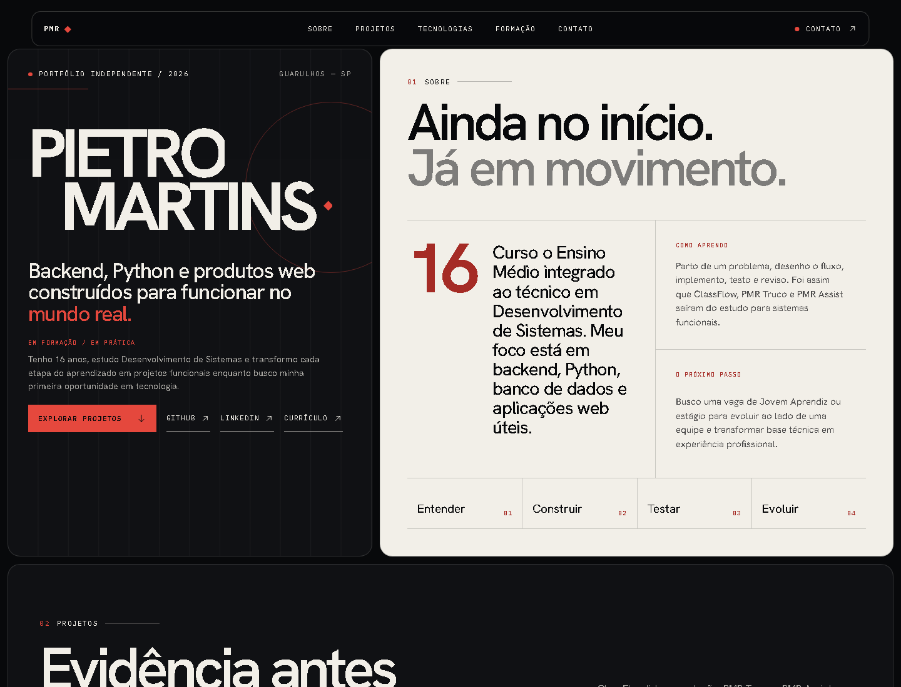

# Pietro Martins — Portfólio



Portfólio profissional de Pietro Martins Ramos, estudante técnico em Desenvolvimento de Sistemas com foco em backend, Python e aplicações web. A página foi construída para apresentar contexto, decisões e evidências — sem ampliar experiência ou competências além do que os projetos demonstram.

## Direção

A interface segue a ideia **“Evidência, não promessa”**: composição editorial, tipografia em grande escala, grid aparente e contraste entre preto, papel e vermelho-sinal. Não há templates de cards, efeitos 3D ou animações gratuitas; o movimento é discreto e respeita `prefers-reduced-motion`.

## Projetos apresentados

- **ClassFlow:** organização acadêmica em Python, Flask, Supabase e PostgreSQL, com case técnico público e código privado.
- **PMR Truco:** multiplayer em tempo real com Next.js, TypeScript e Supabase.
- **PMR Assist:** PWA de organização pessoal com assistente baseado em ferramentas estruturadas.

As imagens usadas são capturas reais das versões analisadas. Links privados e integrações ainda em validação são identificados de forma explícita no conteúdo.

## Stack do portfólio

- Next.js 16 com App Router e Server Components
- React 19 e TypeScript estrito
- Tailwind CSS 4 como base CSS-first
- Motion para reveals progressivos
- `next/image` e `next/font` para mídia e tipografia otimizadas
- Playwright e axe-core para testes responsivos e de acessibilidade

## Recursos

- landing page responsiva com composição própria para mobile;
- galeria editorial compacta com os três projetos no mesmo plano;
- cases completos em dialogs acessíveis, sem troca de rota;
- fechamento por botão, minimização, `Escape` e clique no backdrop;
- currículo em PDF para download;
- navegação por teclado, skip link, foco visível e menu mobile acessível;
- metadados Open Graph/Twitter, JSON-LD, favicon, manifest, sitemap e robots;
- imagem social gerada pelo próprio Next.js;
- auditoria visual automatizada em desktop, tablet e celular.

## Execução local

Requer Node.js 20.9 ou superior; Node.js 24 LTS é recomendado.

```bash
npm install
npm run dev
```

Abra [http://localhost:3000](http://localhost:3000).

### Verificações

```bash
npm run lint
npm run typecheck
npm test
npm run build
npm run audit:visual
```

`npm run check` verifica formatação, lint, tipos, build e testes de navegador em sequência.
`npm run audit:visual` prepara o build e o servidor quando necessário, salva capturas e um relatório JSON em `artifacts/browser-audit` e não altera a prévia pública por padrão.

## Estrutura

```text
src/
├── app/          # página, estilos e metadados do App Router
├── components/   # navegação, motion e elementos compartilhados
└── lib/          # conteúdo verificável e configuração do site
public/
├── downloads/    # currículo
└── images/       # capturas reais e prévia do projeto
scripts/          # auditoria visual com Playwright
tests/            # smoke, links, responsividade e acessibilidade
```

## Deploy

O projeto é estático no caminho principal e está preparado para a Vercel, sem banco de dados ou variáveis secretas. No ambiente de produção, configure a URL canônica:

```bash
NEXT_PUBLIC_SITE_URL=https://seu-dominio.com
```

Depois, execute `npm run check` e publique o projeto. Na Vercel, apenas o ambiente `production` é indexável. Em outro provedor, configure também `NEXT_PUBLIC_INDEXABLE=true`; previews e ambiente local permanecem com `noindex` por segurança.

## Contato

- [LinkedIn](https://www.linkedin.com/in/pietropmr/)
- [GitHub](https://github.com/itsPMR)
- [pietrosempre22@gmail.com](mailto:pietrosempre22@gmail.com)
